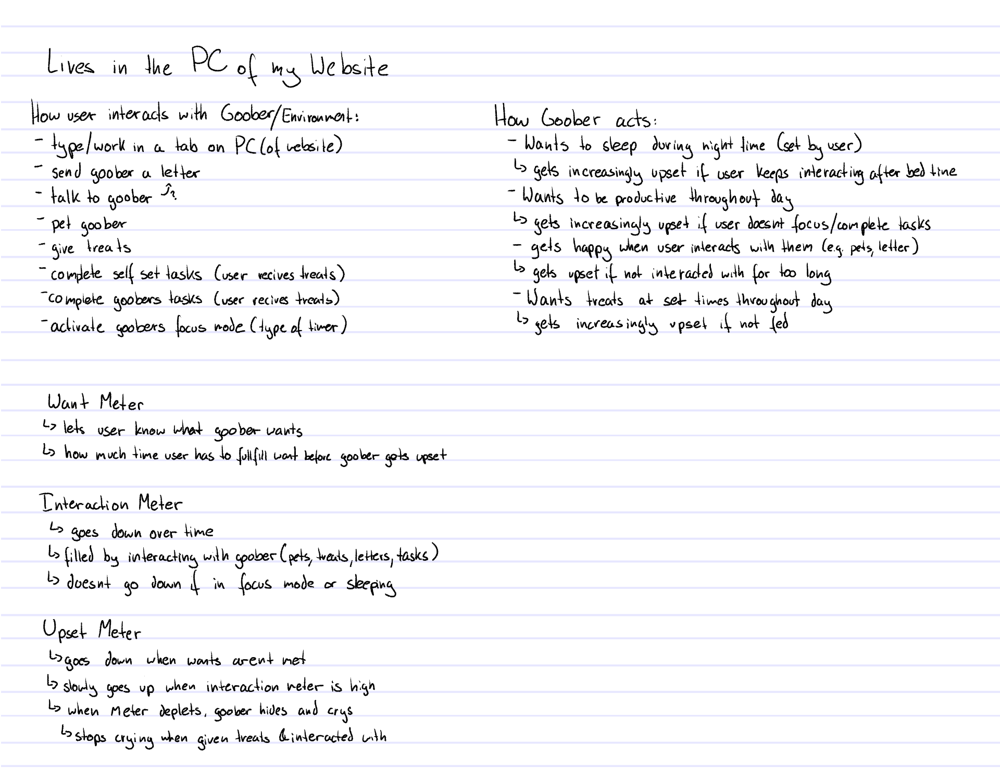
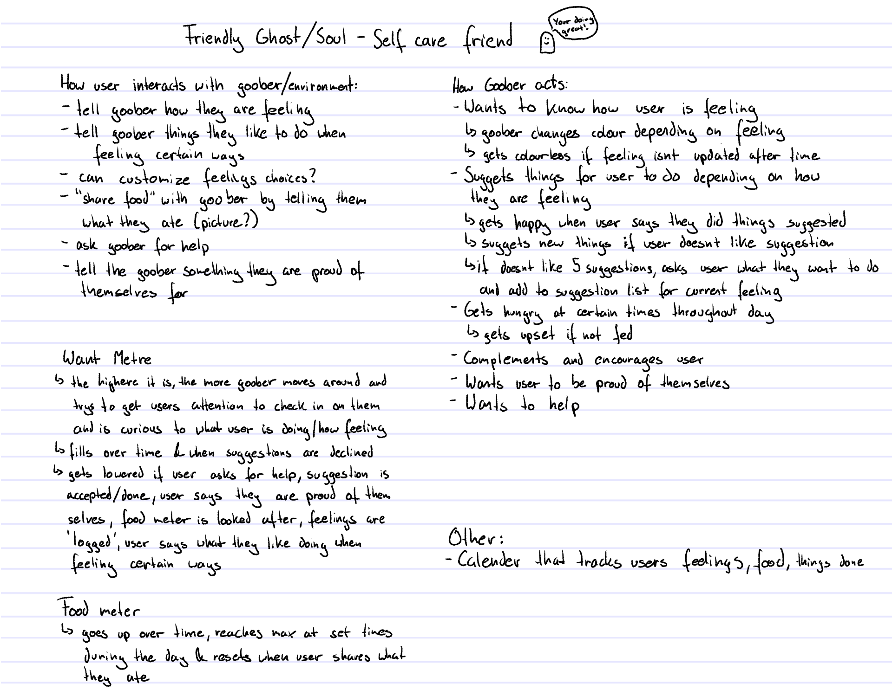

# Familiar-Project
 mddn 242 project 2

AI used: Clause using Sonnet 4.6  
font used: https://fonts.google.com/selection/embed  

For simplicity i will call the familiar a goober until it has been given a 'shape'/ name  

Response to the brief:  
im very excited about this project. I think its a fun idea to create a little goober and designing it in a way that affects how the user feels/ interacts with the goober. Im also very excited about working in p5js again since I understand how it works (its where i learned my current coding skills so im comfy here) which means that I dont have to rely on and use AI too much throughout this project but can also do a lot myself. Yes using AI might make the process quicker but my goal is to learn how to code so im using this project as a learning opportunity and only using AI when i get stuck or take too much time on a task that it starts negatively affecting the timeline of my project.  

Notes and opinions:  
19/04  
    To be very honest i feel very discouraged about this project at the moment. I think the main issue is that the course isnt what i was hoping it to be, which was to learn how to code these things. I really just hate having to use AI and having the feeling that I rely on it because the actual coding isnt being taught and it isnt possible to do the project without using AI (unless i make my idea really small) because it will be too out of scope and take too much time. It is such a stupid dilemma and I really dont know how to deal with it. To be completely honest i just want to give up because this doesnt feel 'worth it'. I would rather spend my time learning how to do the code so that i know how it works and can understand everything rather than spending it making something with AI that I know I wont be happy with since i cant really use it to achieve my 'goal'. I also dont think i'll be using any of these projects in my portfolio because I am not at all proud of using AI to make things. I think the true value behind things is when human effort and care and knowledge has been put into a project. I do think that I wouldnt be feeling as strongly about this if I already knew how to do the steps and rather use AI to make it quicker so that i can focus on other stuff but because i know 'nothing' about what im actually doing/ what the AI is doing.   
    My current plan is to just take a way simpler idea and see what i can do myself and still use this as a learning opportunity in some way so that i actually gain something from this rather than juts doing something just to hand it in for the project. My idea is to use AI to teach me how to do it but then i still do the actual coding myself using what the AI made as a guide for how different things work. I fins this quite a shame because it take the opportunity and job away from a real person who could teach me this but that doesnt seem to be a proper option at the moment so I will try to do the best out of what i have.  
    As much as I appreciate how cool AI could be and how it can be used to help us achieve more things, i really really hate the opportunities it is taking away from us, especially in a learning field.  
23/04  
    Instead of asking AI for help in certain situations i could have also looked through some example files but since they have been very overwhelming the last couple times i looked at them i opted for a different way. I could have also looked online but my current 'plan' is to try to work more with AI to try to get more accustomed to using it if I ever need that skill in the future. Im also trying out a new mindset of viewing the AI as a little guy whos eager to help and so i give it the tasks that are mundane and tedious for me or tasks that would 'stress me out' more than they are worth. I think this is probably a way that a lot of people view AI bots but for me it is still a little hard to not view them as 'enemies who are stealing peoples jobs'. once i have some spare time i should do some more research into the 'AI is stealing peoples jobs' to see if it as actually as 'scary' as it seems or if they really are just little guys.  
    this also sparks a new thought: treating AI bots as a 'little guy who wants to help' is also 'taking away jobs' because usually thats what the newbies/ interns do that are still learning how to do tha job properly and need these 'simple' tasks. It all just seems like a big moral dilemma, especially in a time/ situation where finding a job is really difficult due to high demand. I also think that it can get really dangerous if companies stop hiring people, especially people with no experience (e.g. straight out of uni/ school), with the thought that 'AI can just do that'
    I dont know if this is already talked about but i think it would be very important for my university to talk about things like this, especially in courses where using AI is a 'must'  
25/04  
    -Sometimes working with claud was kind of frustrating because there where some issues that i fixed and then when telling claude about the fix I made in order to move onto the next thing, it told me that my way 'wasnt clean enough', i then asked it how else to fix it and after it did some thinking it came to the conclusion that my way was actually the best way to do it... I appreciate it wanting to make sure that the code is clean and optimized but i wish it would have done the checking before it told me that my way wasnt good (this probably has more to do with my own 'insecurity' of being told im wrong but thats a separate thing :D)  
    -this might be because im tired but it drives me crazy when it changes its mind of how to do something half way through the message:
    'do this, this and this. or actually no! do this this and that instead!' 
    i guess its writing how its working/ thinking but its so frustrating when your trying to follow along its throughout process and it changes half way through you understanding it  
    -im struggling to understand why it makes mistakes... Even when getting no new information other than 'it doesnt work and i think the issue is blah blah blah' it can realize what the problem is so why didnt it do that in the first place? humans are the things that make mistakes but AI isnt human. or has it 'learnt' so much that it now 'makes mistakes' like humans do too?   
    When asking AI this:  
        AI makes mistakes in coding because it operates on probabilistic pattern matching rather than true logical understanding, often prioritizing statistical likelihood over functional correctness. It predicts the next likely code snippet based on training data, leading to hallucinations, outdated library usage, lack of production-level robustness, and poor handling of complex, multi-step logic.  
    so basically its kind of a terrible thing to use for coding and things that are logic based.... i simply dont understand  
26/04  
    -why does claude suggest things for me to do and then it turns out that the function doesnt even exist in p5js?????? its driving me crazy constantly fact checking everything and having to problem solve. i thought the AI was supposed to be smart.... At this rate it would be easier to do it myself...  
28/04  
    -getting frustrated again with the fact that when i use AI for certain 'complex' things, it does it in a 'complicated way' and then i dont fully know what is happening or how to fix it (e.g. hunger timer) which would not be the case if i did it myself (e.g. doing my own research and using p5js websites etc.). Yes I can ask AI to explain it but i wouldnt have the same confdence comparede to me making it mysef.  
29/04  
    -its quite 'nice' working with AI when it works without 'doing things wrong'. But I still feel like i am missing out on a lot of opportunities to learn and better my skills. Yes it does things faster working with AI but i am still very much under the impression that it is better to do it yourself because then you have more control and have more knowledge on how to fix problems and use similar systems in the future. Its a shame how many learning opportunities AI takes from us and I think it should only really be used once someone has learned how to properly code without relying on AI to help in order to make certain tasks 'quicker', instead of using Ai as a 'step skipper'.  
    As fun as this project has been and as much as I have learnt, I really just wish that we would be taught how to code and thereby learn a much more valuable skill.  

idea 1:  
I want to have a goober that lives in the PC of my website (from project 1) which helps the user be 'productive' by rewarding them for doing tasks.   
  
However after a lot more thinking and iterating the idea ive realized that it is way too big for the scope of this project. I could scale it down by removing parts (like the built in word and other applications) but i wouldnt enjoy it as much since there are just so many more idea i have for it. I also worry that it will be too much like 'focus friend' or 'finch'.   

idea 2:  
have a goober that responds to how the user is feeling and helps look after them  
  

Goober communicates to user through 'translator device' on screen and makes a small noise every time they say something   
------------------------------------------------------

When user presses on goober, goober asks how they can help:  
    - log a feeling  
        ⤷ goober encourages user and suggests things for user to do depending on the feeling  
        ⤷ goober changes colour depending on feeling, turns dark grey when feeling hasnt been loged in 6/8 hours  
    - log things they like to do  
        ⤷ Goober refers to this when suggesting things  
    - share food  
        ⤷ user tells goober what food they had (show picture?)  
        ⤷ goober could ask and log the users enjoyment of the food to refer to later  
        ⤷ brings down 'Hunger meter'  
    - ask goober for help  
        ⤷ task help: suggests things to do depending on users feeling,  
        ⤷ feeling down: goober compliments and encourages user to keep going and shares 'happy facts' to hopefully cheer up user, also asks if they want 'task help'  
        ⤷ food help: suggests different meals (links recipes?) from 'goober existing data base' or from what user has added to 'food log'  
    - user shares that they are proud of themselves for something  

potential stuff:  
    -user can choose 2 emotions and have goober be a gradient?  
    - check calender   
        ⤷ shows how user was feeling on certain days. when pressing on specific day, expands to show all feelings, what user did (suggestions followed), what food they had etc.  
    
Want Meter:  
    -the higher it is the more goober wants to check in with user  
        ⤷ moves around more and 'calls out' to get users attention  
    -increases over time  
        ⤷ bumps up a bit when user doesnt like goobers suggestions  
        ⤷ increases quicker when food meter hits max  
    -decreases when user interacts with goober  
        ⤷ big decrease when user accepts/ dose goobers suggestion  
        ⤷ big decrease when food meter is reset  

Hunger Meter:  
    - starts going up at set time during the day e.g. at 8am for breakfast, 1pm for lunch and 6pm for dinner (these times could be set by the user to fit their habits)  
        ⤷ as meter goes up, goober starts to let user know that they are hungry with the frequency increasing as the meter incases. (goobers expression will also change and tummy grumbles can be heard)  
    - hits max 2 hours after starting  
        ⤷ when max is hit, goober starts to 'riot' for food, holding up a sign and pacing from side to side, making noise  
    - meter gets reset when user 'shares food' (by pressing on the goober and telling them what food they had), goober says thanks for sharing food and has happy expression.   

List of feelings: (these could be customizable by user)  
    
    - neutral/calm (white/cream)  #fff5de 
    - happy (yellow)              #effc77 
    - excited (lime)              #a5eb64 
    - panic/scared (dark green)   #87c951 
    - overwhelmed (cyan)          #4ec9a4 
    - distracted (light blue)     #80eafd 
    - sad (blue)                  #66a2fd 
    - bored (deep purple)         #9f77fc 
    - annoyed (magenta)           #d677fc 
    - angry (red)                 #fc7777 
    - tired (orange)              #fccd77 
    - nothing (grey)              #969696 

Goobers States:  
    -Riot State:  
        ⤷ goober holds up a sign with what it wants and is pacing from side to side of screen, making lots of noise  
    -Reactions:  
        ⤷ contempt/ neutral face when goober is just floating about :)  
        ⤷ happy face- when user interacts with goober :D  
        ⤷ sad face- when user doesnt accept goobers suggestions :(  
        ⤷ upset/ angry face- when in riot mode >:(  
    -Colour state:  
        ⤷ changes depending on how user is feeling  
        ⤷ goes dark grey when feelings arent logged in 6/8 hours   
    -Curious state over 4 hours  
        ⤷ not curious = all normal  
        ⤷ 0.25 curious = makes noise every 20min  
        ⤷ 0.5 curious = comes close to screen and makes noise every 20min  
        ⤷ 0.75 curious = starts slowly walking from side to side, makes noise every 10min  
        ⤷ max curious = 'riot state' actives  
    -Hunger state over 2 hours   
        ⤷ not hungry = all normal  
        ⤷ 0.25 hungry = lets user know they are hungry/ makes noise every 20min  
        ⤷ 0.5 hungry = tummy starts making grumbly noise every 20min. makes noise every 15min  
        ⤷ 0.75 hungry = starts slowly walking from side to side, tummy grumble every 10min, makes noise every 7min  
        ⤷ max hungry = 'riot state' actives  

 
Starting to work:  
    -I was initially very overwhelmed and didnt know where to start. I tried to strip the given files down to bare bones so that I could make my own creation but it was really hard to tell what was needed and what wasnt and i kept getting really frustrated and almost panicky because i didnt know what almost any of the code meant/ did which made me feel very discouraged.  
    -My solution (which im not a big fan of but couldnt think of another way) was to ask Claude for help (since we are supposed to be working with AI anyway). I asked it to help me make some basic starting files:  
        Hi there!  
        I want to do a coding project. can you help me set up some basic files so that i can work from them easily?  
        I want to have an html files that loads a canvas from a sketch.js which runs off p5js. I also want to have a style.css file which i can use to format/ style things.   
        Please let me know if you need more information.  
    i then asked it to include the 'mobile' code from the files provided on nuku since i think that is important.  
    - rough screen shot of the files claude provided me with ↴  
  

Goober creation:  
    - I drew a little ghost to reppresent the goober   
    which i then loaded in as a template/reference to help me allign the points of the cruverVertexs to draw the goober   
    - i have drawn everything based one gooberPosX and gooberPosY (currently assigned at the top of the sketch) so that later when i make the goober move, everything follows with it  
    - then added the 4 different faces/ reactions in has (these are currently not triggered by anything and only defined at the top of the sketch, they will later be triggered by certain states being triggered)  

Menu creation:  
    - i made buttons by drawing shapes and then in the 'mouseClicked' function check if the mouse was clicked in the area of the shape  
     

Feelings creation:  
    - I added all the feelings as variables in the top of the script so that they can easliy be changes to test things.   
    - the feelings menu lays out all the feelings as different buttons, also showing the colour of the feeling  
    - using the same 'button logic' of the menu, when the user presses on a feeling button, the goober changes to the respective colour.   
    ⤷ things to fix:  
        - currently whenever the mouse is clicked it turns all feelings false apart from the clicked on which is very chunky code and maybe could be simplified somehow  
        - there currently is no way to store the feeling so the goober returns to 'default' colour when reloading the page as all 'progress/ information' is reset  
        ⤷ asked claude for help: (23/04)  
          
        this was in the same conversation where i previously asked for help fixing an issue (i just spelt something wrong...) so the AI already knew some of my variables.  
        it said to add the following line:  
            calm = localStorage.getItem('calm') === 'true';  
        i didnt fully know what this meant and since at the start all feelings are supposed to be false i set the === to false which ended upo breaking everything. i told this to Claude and it explained to me how it works: the true only means "if the saved string is 'true', give me the boolean true, otherwise give me false". Which makes a lot more sense.  
        ⤷ the 'save feelings' now works! when i reload the goober stays the same colour instead or reverting back to grey :D  

Suggestions: 
    -the goober will suggest things for the user to do depending on the users current feeling. the suggestion menu will pop up after a feeling was selected, when the user asks for a suggestion via the 'ask for help' menu and when a previous suggestion was declined.  
suggestions menu:  
    - i want the top text to say 'blah blah blah currentFeeling blah blah' so i asked AI again to help me. (I could have definitely googled this/ done quick research for this but now little claude buddy has something to do)  
     
    -i added a 'thinking' phase to transition between different suggestions if the previous one was declined. I used AI to help me make a timer  
 
    had some issues but fixed after more chatting to claude: I had to let thinkingStartTime = Infinity; 
picking the suggestion: 
    -i want the goober to give the user a random suggestion from a certain selection of suggestions depending on the feeling.  
    My initial thought of how this would work is to store these suggestions in arrays which the 'suggestion variable' pulls from. Each feeling would have its own array with about 5 suggestions.  
    -I will ask claude for help to give the little guy something to do (yes i am tricking my brain into 'feeling sorry' for the AI so that i interact with it more for the sake of this project) and since i am not 100% sure if my idea for the code works so i would have to google for help anyway.  
      
    Claude suggested basically exactly what i thought i needed to do which gives me confidence that I know what im doing more and more 
    ⤷ this theoretically works for now but when pressing 'no thanks' there is a chance that a suggestion that has already been shown gets picked again which would get annoying, especially when the user is already frustrated with other things.  
    I asked claude and doing this took about 3 hours of back and forth so I will not document it all here since it will drive me mad. 
    Here is the final code that claude came up with after i gave it my opinions and ideas of how to do things: 
     
    this code still had an issue because it gave 6 suggestions instead of 5 meaning it repeats one. I fixed this by changing (availableSuggestions.length === 0) to (availableSuggestions.length === 1) to which claude said that it wasn't clean enough but after re-analyzing all the code i had given it so far (which is as little as possible so that i have the most control over what sections the AI changes/ works on) realized that it was the best fix after all.  
    -it broke again... AIs new fix: 
     
    -update: it bloody sucks and im so fed up with stupid AI  
     
    it keeps 'making changes' then i ask why and then it realizes that its change is actually wrong and goes back to the way i suggested to do it. i hate it here so much right now... 
    update: i figured it out. to be honest not sure what i did (just re-arranged things within the mouseCLicked) but it works :D once the user has cycled through all 5 available suggestion, the 'im out of suggestions' screen shows up. when the user pressed 'can i hear them again' it restarts with no issues.  

making all menus close when user presses outside goober 
    - i used the same logic as for the buttons so that when the user clicks outside of the goober and menu area, all show-menus get turned false. I did this by defining the area that would be 'mouseOnGoober' and 'flipping' it using (!(mouseX > gooberPosX-115 && etc etc etc))  

-------------------------------------------------------------------------
sharing food:  
    - i want the user to be able to share a description of what they ate, maybe even a picture, to which the goober responds with something like 'ooo thats yummy! i hope you enjoyed it and that it gave you lots of fuel'. This will directly relate to the 'hunger meter'.  
    -plan: I will start by making a button in the main menu, a base layout for the 'sharing food' menu, and a 'food response' menu. Since i dont know how to add a section where the user can type in text or insert images I will ask AI for help so little Claud bot has something to do.  
    Working with the AI took some back and forth again as it didnt seem to fully understand what i was asking for. here is the output:  
      

Hunger Meter:
    -i asked claude for help with the code of how to make a value increase over time etc  
      
    this did quite work since i needed to be able to start and stop the meter and for the value to be stored so that it would carry over when reloading the page  
    i asked claude for more help to make this possible and it took about 4 hours with constant back and forth again of things not working since AI somehow messed up or didnt take things into consideration....  
    here is the 'final' thing that claude came up with after a lot of trouble shooting:  
     
    -asking AI to help with triggering it at a certain time of day:  
    
    ... just realized that this actually doesnt work when the page isnt open which isnt ideal... i would instead need to make something that checks how long it has been since e.g. breakfast time/ 8 am and then base the hunger meter off that. im hoping that i can use some of the code i already have..  
    lets aks claude: (took about an hour to trouble shoot)  
    
    ⤷  it dont work...... Because the the 'check timer' which updates hunger ony gets run every 30 seconds, hunger doesnt alwasy reach 100 since the last 'checkTimer' that would update it to 100 would run a couple seconds after e.g. 10am, but since the function doesnt update anymore 2 hours after hunger starts, it doesnt run.  
    -my current solution is to trigger riot mode at 95 instead of 100 because the 'timer' will alwasy make it that far. I would prefer to have a more accurate solution becasue like this I also cant display the number value of hunger since it will never hit 100, but i dont currently have time for it (i will revisit this issue if time alows for it)  

making goober move:  
    -code done by myself :D  
    -started by making moveGoober function that gets triggered when 'isMoving' is set to true so that i can easily stop goober from moving.  
    -inside moveGoober i used gooberPos and 2 new variables rightEdge and leftEdge to move the goober until it hits one of the edges (left/right edge ads a margin so that the goober never actually touches the edge of the window). left/right edge are also updated in windowResized to make sure it stay accurate.  
    -if i have more time i want to add slight up and down movement as well to make goober seem more floaty but this works for now  

making the text flip when goober is a certain distance across the screen.  
    -theoretically this should be easily done by just flipping x to be negative instead of positve for the text but this is not high enough of a priority so i will do this at the end if i have enough time. 

different states: 
    -i used if statements to check the value of hunger to trigger different states and alerts  
    
    -alerts before goober is 100% hungry get triggered after a certain amount of time and stay visible for a certain amount of time. this is all done using timers and checking how much time has passed since they where started.  
    -i used the same 'timer' mechanic as for 'thinking' to make goober be happy when the user interacts with them positively (e.g. log feeling, share food, accept suggestion) and sad when the user declines a suggestion. 

help menu:  
    -the button 'ask for help' in the main menu redirects the user to the 'help menu' which offers: task suggestions, food suggestions, and encouragement.   
    -when pressing 'task suggestion' the same 'suggestion' menu that opens after logging a feeling shows.  
    -when pressing 'encouragement' the goober pulls from an array and gives the user a random compliment/ advice  
    ⤷ done easily using an array and 'random'. 'encouragement' doesn't need storing/ saving locally since I only want the goober to give once 'encouragement' per 'ask for help'. If the user needs more then they can ask for help again where there is of course a chance that goober will say the same things. I like this since it 'enforces' goobers previous 'encouragement'. Additionally by adding lots of 'encouragements' the chance of doubling up is smaller. I added 11 options for now but ideally i would have a lot more (just not worth my time adding more at this moment)  
    -gives a random recipe using this API: www.themealdb.com/api/json/v1/1/random.php  
    Since the API has a huge amount of recipes I decided to let the user 'ask for a different recipe' unlimited times (instead of cutting it off after 5 options like the task suggestions)  
    ⤷ I managed to get it working so that it would display the name and the link but the link wasnt clickable so i asked claude for some help:  
      
    This was really easy and worked on the first try.  

'want meter':  
    -the want meter works similarly to the 'hunger meter' in that it increases over time. However it doesnt start at set times during the day but rather 'continuously' increases.  
    -I want the timer to increase by 0.415 every minuit or 25 per hour so that 100% is hit after 4 hours.  
    -Idealy I would like to use some of the code from the 'hunger meter' to make my own version for the 'want meter' to test my skills and what i have learnt so far. Instead I will ask AI for help since I sadly dont have enough time to do it myself.  
    

changing the want meter value when user interacts:  
    -When hunger is higher than 75 i want to increase the speed that the want meter goes up by:  
      
    -when the user interacts with the goober it will increase or decrease the amount of want in the meter:  
    ⤷increase:   
        suggestion declined +3  
    ⤷decrease:   
        feeling logged -50  
        suggestion accepted -30 (enough to cancel out 10 declined suggestions)   
        shared food -50   (enough to cancel out most of the 'speed increase' when hunger is >75)
        asked for encouragement -15  
        asked for food help -15  
    - originally i thought it best for the want value to not be able to go bellow 0 but then realized that it would 'screw over' the user if they did multiple things at once. E.g.: the user logs their feelings and accepts a suggestion which would add to 80, however if the want meter is only 60 then 20 of the users 'earned decrease points' are wasted which may encourage them to wait longer to do certain things like eat and ask for help which is the very opposite of what the goobers purpose is.  
    